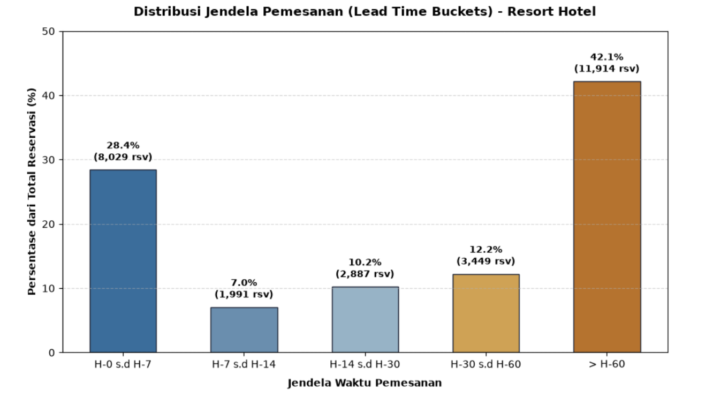
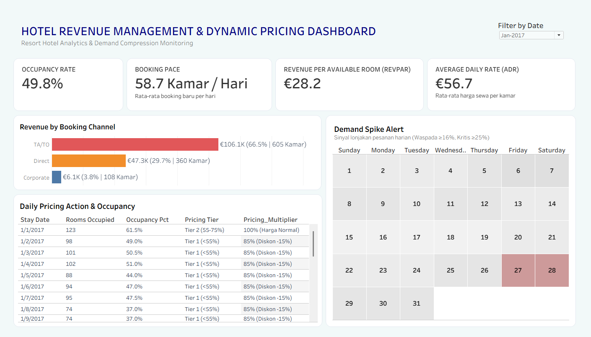

# 🏨 Resort Hotel Revenue Analysis

Resort hotel revenue analysis &amp; dynamic pricing engine designed to assist Revenue Managers in rate setting, OTA channel optimization, and tracking Occupancy, ADR, and RevPAR.
> 📊 **Dashboard Interaktif:** [Buka di Tableau Public](https://public.tableau.com/) *(Ganti dengan tautan Tableau Public Anda)*

---

## 📌 Ringkasan Eksekutif (Executive Summary)

Banyak pihak mengira **okupansi tinggi (>85%)** berarti hotel berkinerja sehat. Faktanya, Resort Hotel berkapasitas 200 kamar ini justru mengalami **okupansi semu (*false fullness*)**:
* Kamar hampir selalu terisi penuh, tetapi rata-rata harga sewa harian (**ADR**) dan pendapatan per kamar (**RevPAR**) tertinggal jauh di bawah potensinya.
* Kebanyakan Revenue dikuasai datang dari OTA (*Online Travel Agent*) dengan tarif potongan komisi tinggi
* Jika kita Menggunakan harga flat tanpa strategi penyesuaian (dynamic pricing), hal ini menyebabkan kamar terjual terlalu dini di tarif terendah. Hotel pun kehilangan potensi pendapatan tinggi dari tamu last-minute yang bersedia membayar lebih mahal.

Proyek ini menghadirkan sistem pendukung keputusan (*decision-support system*) berbasis Python dan Tableau untuk mendeteksi lonjakan pesanan mendadak dan menyesuaikan harga secara bertingkat (naik hingga +40%) sebelum kamar habis terjual murah

---

## 🎯 Manfaat Proyek Bagi Revenue Manager & Manajemen

* **Penetapan Tarif Harian Otomatis:** Memberi panduan penyesuaian tarif berbasis tingkat Occupancy Rate.
* **Peringatan Dini Lonjakan Permintaan (*Demand Spike Alert*):** Mendeteksi tanggal-tanggal dengan laju pesanan tak wajar.

---

## 📊 Analisis Perilaku Jendela Pemesanan (Lead Time Behavior)

Grafik distribusi pemesanan di atas membongkar kekeliruan umum dalam operasional hotel: **kebiasaan membanting harga di detik-detik terakhir (*last-minute discounting*) demi mengejar kamar terisi penuh.**
Menurunkan harga di menit-menit akhir terbukti merugikan hotel. Sebaliknya, hotel harusnya memaksimalkan RevPAR Menjelang Hari-H. Karena permintaan last-minute tetap tinggi (28.4%), strategi ini secara langsung mendongkrak **ADR** dan menghasilkan **RevPAR** maksimal tanpa mengorbankan okupansi.

---

## 🖥️ Tampilan Dashboard Tableau

1. **Kartu Indikator Utama (KPI Cards):** Menyajikan performa bulanan untuk *Occupancy*, *Booking Pace* harian, *ADR*, dan *RevPAR*.
2. **Kontribusi Saluran Penjualan:** Perbandingan porsi kamar dan omzet antara *TA/TO*, *Direct*, dan *Corporate*[cite: 1].
3. **Demand Spike Alert:** Kalender pemantau yang memberi sinyal visual ketika pada tanggal tertentu sedang terjadi lonjakan permintaan kamar dalam jumlah besar secara mendadak.
4. **Daily Pricing Action:** Tabel operasional yang membantu menentukan harga kamar yang tepat secara harian berdasarkan tingkat okupansi hotel.

| Kategori Okupansi | Rekomendasi Tarif |
| :---: | :---: |
| $< 55\%$[cite: 1] | Diskon 15% (0.85x)[cite: 1] |
| $55\% - 75\%$[cite: 1] | Harga Normal (1.00x)[cite: 1] |
| $75\% - 90\%$[cite: 1] | Naik 20% (1.20x)[cite: 1] |
| $> 90\%$[cite: 1] | Naik 40% (1.40x)[cite: 1] |

---

## 💰 Dampak Finansial (Revenue Uplift)

Penerapan strategi Dynamic Pricing pada data operasional hotel menghasilkan peningkatan performa bisnis yang terukur:
* **Net Revenue Uplift (+22.59%)**: Jika menerapkan strategi dynamic pricing, Total omzet dapat meningkat sebesar €2.620.583,46 (dari €11,60 juta menjadi €14,22 juta) tanpa penambahan unit kamar maupun biaya operasional fisik.
